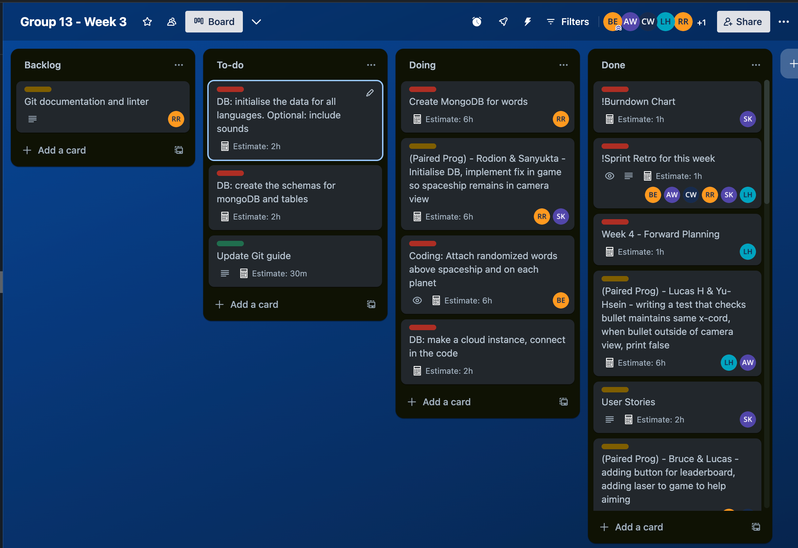
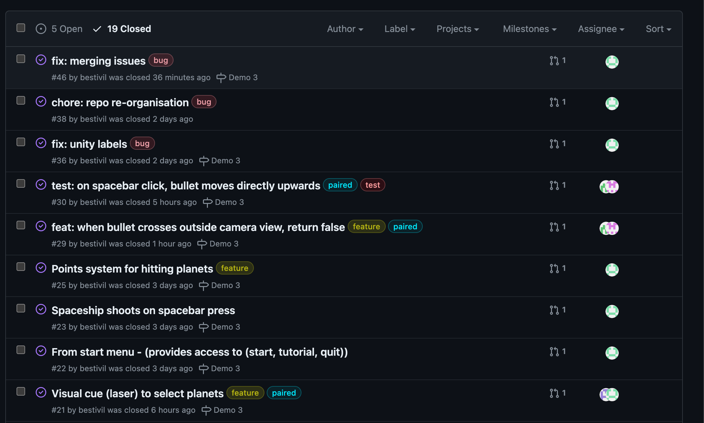
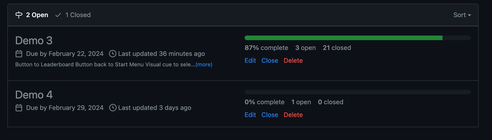
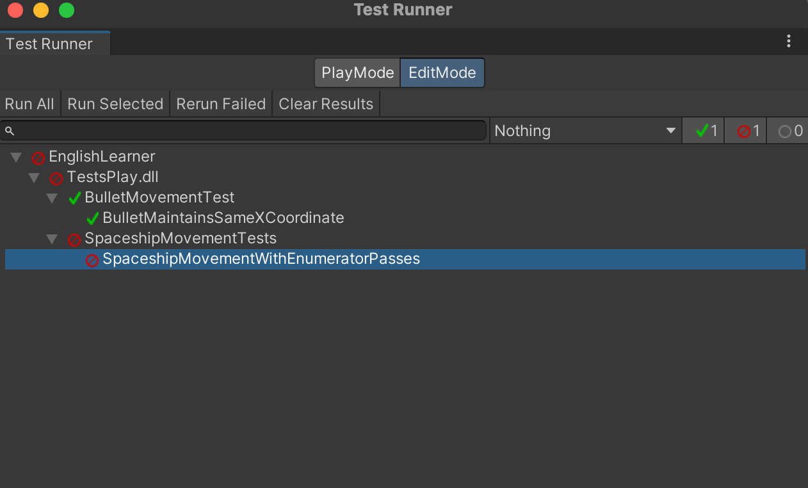
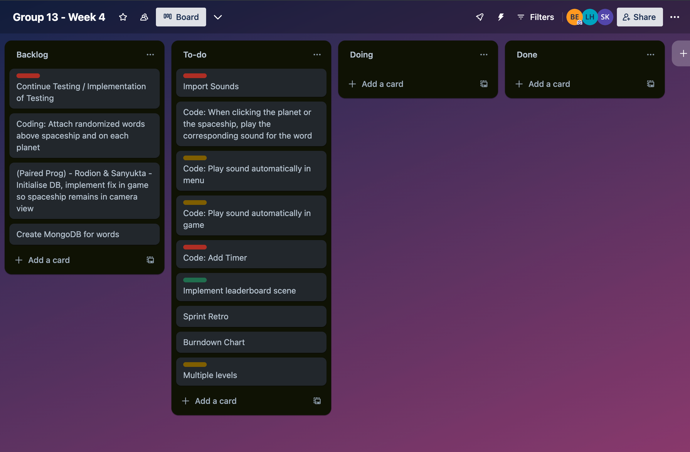

# 19th & 21st Feb 24 - Sprint Retro & Breakdown Chart

## Sprint Retrospective - Week 2

| Task                        | What went well?                                                                                                         | Would've been even better if?                                                                                                                              |
| --------------------------- | ----------------------------------------------------------------------------------------------------------------------- | ---------------------------------------------------------------------------------------------------------------------------------------------------------- |
| Acceptance Requirements     | Quite straightforward; had prior experience completing one Had functional requirements already available to base it off | Some requirements were not clear, had to ammend acceptance criteria                                                                                        |
| Expanding Learning Outcomes | Easy to do; was already built out so just needed expansion.                                                             | Due to constraints, the LO we could produce are limited                                                                                                    |
| Finding Unity Assets        | Most assets were relatively easy to find, using the Unity Store                                                         | Most were paid so difficult to find a free version that was suitable                                                                                       |
| Personality Questionaire    | Easy to fill; Gave succinct overview of everyone's best roles, and potential area's to contribute to the team           | Some missing roles, which had to be delegated                                                                                                              |
| Translations                | Native speakers were translating the words, ensuring accuracy                                                           | They knew all the words, but had to translate with support of Google                                                                                       |
| MVP                         | Researched another language game MVP, and used it as basis to create a succinct and relevant MVP for this game          | It was sightly more difficult to estimate possible level of game in a few short weeks, would've been better if there was further time to develop the game. |
| UML                         | Experience in flowcharts so simple to understand and design                                                             | Better if spoken to potential users before creating the UML diagrams                                                                                       |

## Sprint Retrospective - Week 3

| Task                          | Time (actual vs estimation) | What went Well?                                                          | Even Better If?                                                                                              |
| ----------------------------- | --------------------------- | ------------------------------------------------------------------------ | ------------------------------------------------------------------------------------------------------------ |
| Forward Planning              | 10mins vs 1hr               | Straightforward, mainly sound based tasks.                               | More baseline tasks to plan based on understanding Week 3 progress.                                          |
| Paired (Lucas & Yu-Hsein)     | 1hr vs 6hr                  | Systems worked on both computers, coding was efficient                   | N/A                                                                                                          |
| Paired (Bruce and Lucas)      | 1hr30min vs 4hr             | Worked well, explaining process for adding UI elements to the Unity game | Work in-person for better efficiency.                                                                        |
| User Stories                  | 1hr 15min vs 2hr            | used MVP as a basis                                                      | Would’ve had chance to speak to potential users, but ethics issues was a blockade.                           |
| Prononciations (Chinese)      | 1hr30min vs 2hr             | Microsoft translate and phone to record pronunciations.                  | Pronunciations from internet was delayed, so had to record several times to get the best effect.             |
| Market Research               | 1hr vs 6hr                  | Google for other language games, and played some to relate to our game   | Didn’t find many games quickly.                                                                              |
| Create Menu Layout            | 2hr vs 1 day                | Able to create a simple interactive, cyclical layout quickly.            | Better online tutorials and unity config to make it easier to generate scenes, object and onClick functions. |
| Integrate Shoot               | 1hr vs 1 day                | Basic physics of upwards motion was a simple process to implement.       | I knew to bundle different objects and layer a script on entire object to co-ordinate movement               |
| Return to Start Screen button | 30 min vs 30 mins           | Simple to paste objects in unity scene creator.                          | Simple to paste objects in unity scene creator                                                               |

### <b>Breakdown Chart</b>  

### <b>Have you been appropriately using your Kanban board?</b>  

Yes, Trello board has been used for each task.

### <b>Can you show evidence of planning?</b>  

### <b>Can you show evidence of appropriate use of Git (or equivalent)?</b>  

Using git issues for every task, with appropriate label and assignees.

Weekly milestones are tracked to determine the progress for each demonstration.

### <b>Can you show evidence of testing?</b>  

Tests completed to check for both bullet and spaceship movement.

### <b>Can you show evidence that everyone has done something?</b>  

The paired programming tasks was completed in 3 groups of 2.

### <b>What plan did you have for this week?</b>  

Planned to develop the game UI along with further tests that simulate aspects of the game.

### <b>Do you have a sprint backlog for next week?</b>  

Week 4 tasks listed with backlog to the furthest left.

