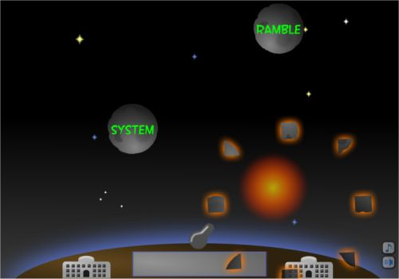

# 5th Feb 24 - Determining Game and First Steps

### <b>Have you all got access to Unity?</b>

- YES

<b>Have you set up Git (or equivalent)?</b>

- YES, full team has Git installed, GitHub account and listed as contributor in this repository.

### <b>Have you decided on an idea for a game? Is it appropriate?</b>

<i>Initial Ideas</i>

1. Language - teaching English (tutorial), having a dropdown in-game and choosing language (Simplified & Traditional Chinese, Hindi, French).
2. Maths-based Game
3. Teaching basic finance

- #### Final Choice - Language Game

### <b>Have you got sketches for a game?</b>

Yes, hand-drawn sketches. Figma version completed before game development.

### <b>Have you thought about the user?</b>

| Users                            | Use Cases                                                                                      |
| -------------------------------- | ---------------------------------------------------------------------------------------------- |
| English as 2nd Language Students | - Understand vocabulary more efficiently - Build strong word association with primary language |
| Teachers                         | - Help teach English vocab through interactivity                                               |

### Have you thought about the learning outcome(s)?

- Learn basic words
- Word association
- Lead to improvement in English spelling

### Have you thought about the game mechanics?

| Game Features                |
| ---------------------------- |
| Multi-player option          |
| Local and Global Leaderboard |
| Points based on answer speed |

### Do you have a plan for what you are going to do by next week?

- Get list of words in all required languages
- Sketches of inital game design

### How the player will play the game?

Player gets word in local language and has to find the match in English. Game has a word bank, and with each level the time to selected the game is shorter. Uses the keyboard to selected the word. Similar to the example image shown below.

